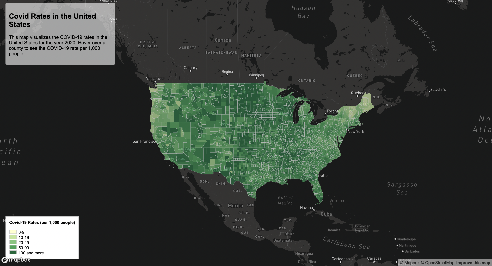

# COVID-19 Choropleth Map
The COVID-19 Choropleth Map project aims to visualize the rates of COVID-19 cases across different regions in the United States for the year 2020. This interactive map provides users with an intuitive interface to explore COVID-19 rates per 1,000 people at the county level. By hovering over each county, users can view detailed information about the COVID-19 rate, allowing for a better understanding of the geographical distribution of the pandemic.

Link to map: ()

# Proportional Symbol Map
The Proportional Symbol Map project visualizes the distribution of COVID-19 cases across the United States using proportional symbols. Each symbol on the map represents a geographic location, with the size of the symbol proportional to the number of COVID-19 cases in that area. Users can interact with the map to explore the concentration of cases in different regions, gaining insights into the severity and spread of the pandemic.

Link to map: ()

## Primary Functions
- **Interactive Map**: Users can navigate the map by zooming in/out and panning to explore different regions.
- **Hover Tooltip**: Hovering over each county displays a tooltip with information about the COVID-19 rate per 1,000 people.
- **Legend**: The legend provides a color-coded scale to interpret the COVID-19 rates visually.

## Libraries in Use
- [Mapbox GL JS](https://docs.mapbox.com/mapbox-gl-js/api/) - Used for creating interactive and customizable maps.
- [Fetch API](https://developer.mozilla.org/en-US/docs/Web/API/Fetch_API) - Used for fetching GeoJSON data from external sources.

## Data Sources
The project utilizes two main datasets: COVID-19 rates and counts for the year 2020, sourced from The New York Times. These datasets operate at the county level and are complemented by population data from the 2018 American Community Survey (ACS) 5-year estimates. County boundary shapefiles from the U.S. Census Bureau are also used. The COVID-19 case rate, calculated as cases per thousand residents, is a key metric derived from this data. All datasets have been pre-processed to suit the project's needs.

## Credit & Acknowledgment
Data sources for this project include COVID-19 rates and counts data for the year 2020, obtained from The New York Times. Additionally, population data from the 2018 American Community Survey (ACS) 5-year estimates, and U.S. county boundary shapefiles from the U.S. Census Bureau were used
